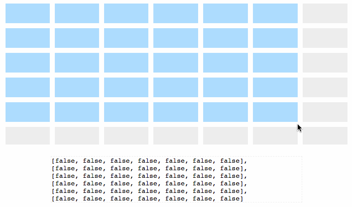

# NgDragSelectTable

angular 6 component



*This project is a Demo, you can clone it to build.*<br>
*Public component in `projects` folder*

## Install

```js
npm install drag-select-table --save
or
yarn add drag-select-table
```

## Usage

```js
import { DragSelectTableModule } from 'projects/drag-select-table/src';

@NgModule({
  imports: [
    ...
    DragSelectTableModule
  ],
})
```

### simple
It's 5 row and 5 column as default.
```html
<ds-table></ds-table>
```

### emit valuesChange

```js
import { Component } from '@angular/core';

@Component({
    selector: 'drag-select-table-demo',
    template: `<ds-table [row]="row" [column]="col" (valuesChange)="updateValues($event)"></ds-table>`
})
export class MultiSelectTableDemo {
    public row = 7;
    public col = 7;

    public updateValues(values) {
        console.log(values);
    }
}
```

### bidirectional bindings

```js
import { Component } from '@angular/core';

@Component({
    selector: 'drag-select-table-demo',
    template: `<ds-table [row]="row" [column]="col" [(values)]="resTable"></ds-table>`
})
export class MultiSelectTableDemo {
    public row = 7;
    public col = 7;
    public resTable = [];
}
```

## Demo Development server

Run `ng serve` for a dev server. Navigate to `http://localhost:4200/`. The app will automatically reload if you change any of the source files.

## Demo Build


## MIT License

Copyright (c) 2018 kai
