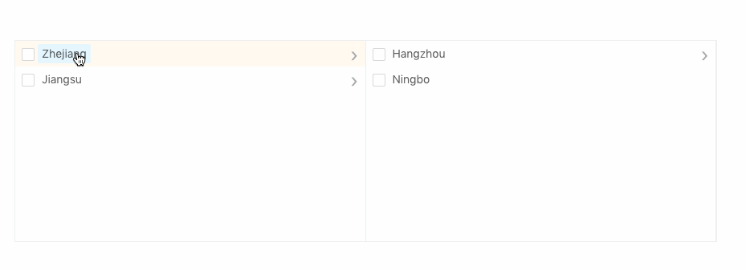

# box-cascader
[](https://nodei.co/npm/box-cascader)

[![NPM Version][npm-image]][npm-url]
[![NPM Downloads][downloads-image]][downloads-url]
[![Node Version][node-image]][node-url]


[npm-image]: https://img.shields.io/npm/v/box-cascader.svg?style=flat-square
[npm-url]: https://npmjs.org/package/box-cascader

[downloads-image]: https://img.shields.io/npm/dm/box-cascader.svg?style=flat-square
[downloads-url]: https://npmjs.org/package/box-cascader

[node-image]: https://img.shields.io/node/v/phantom.svg?style=flat-square
[node-url]: https://nodejs.org/en/download/


angular 6 component



## Install

```bash
npm install box-cascader --save
or
yarn add box-cascader
```

## Usage

```js
import { BoxCascaderModule } from 'box-cascader';

@NgModule({
  imports: [
    ...
    BoxCascaderModule
  ],
})
```

### simple
```js
  nodes = [{
    key: 'zhejiang',
    title: 'Zhejiang',
    children: [{
      key: 'hangzhou',
      title: 'Hangzhou',
      children: [{
        key: 'xihu',
        title: 'West Lake',
        isLeaf: true
      }]
    }, {
      key: 'ningbo',
      title: 'Ningbo',
      isLeaf: true
    }]
  }, {
    key: 'jiangsu',
    title: 'Jiangsu',
    children: [{
      key: 'nanjing',
      title: 'Nanjing',
      children: [{
        key: 'zhonghuamen',
        title: 'Zhong Hua Men',
        isLeaf: true
      }]
    }]
  }];

```
```html
<box-cascader [(ngModel)]="value" [nodes]="nodes" [disabled]="false" required="true"></box-cascader>
```

### 


| prop | desc | type | deafult |
| --- | --- | --- | --- |
| `[ngModel]` | bidirectional bindings | [] | \[] |
| `[nodes]` | nodes array | [] | \[] |
| `(nzClick)` | click function | EventEmitter<NzFormatEmitEvent\> | - |
| `(nzCheckBoxChange)` | Checkbox trigger | EventEmitter<NzFormatEmitEvent\> | - |
